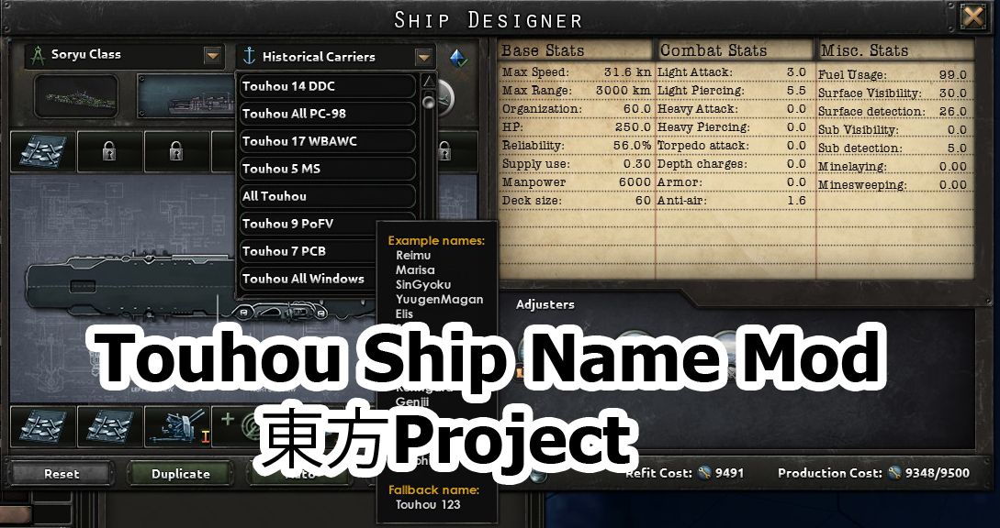

# Hoi4 Ship name lists from Touhou Project
 **Heart of Iron 4 Mod : Touhou character names for ships**

Available on Steam's Workshop

### Brief:
Name lists for ships. Available for every country.

This mod should be compatible with any others mods.

Have not test with Iron man mode.

Compatible game version 1.10.* 

Not affect saved games.

The Mod's version is 1.0.3

### This mod contains the following files:
- Touhou_ship_names.txt
- Touhou_ship_names_l_english.yml

### Details:
- 153 unique character names include all Touhou1 - Touhou18 and some non canon character names.
- Mostly are group by their first appearance in game.
- First name only.
- Available Lists: Touhou1 - Touhou18, All PC-98, All windows, All official Spin-Off games, Print work characters,All Touhou and Inaba (Tewi and Reisen the rest is Inaba [number] (fallback name))  

### Known Issues:
-The Lists are not sorted in game. I don't know how to fix.

### Credit:
Mostly character names are extracted from [wikipedia](https://en.wikipedia.org/wiki/List_of_Touhou_Project_characters).

Touhou Project created by ZUN.

***
I had an idea about group them by stage But due to too many characters re-appear multiple times. It cause too many duplicate name. So I cut it off.